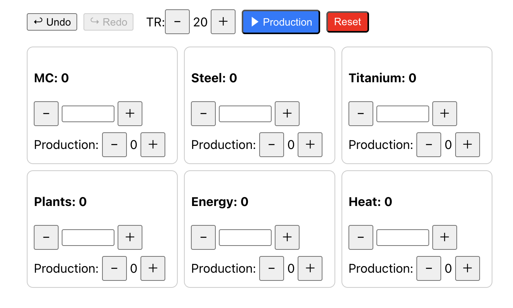

# Red Planet Companion

Red Planet Companion is a fan-made strategy board game companion with React/TypeScript and native SwiftUI clients.

## Demo

[Live Web Demo](https://mars-azure-beta.vercel.app/)

## Screenshot



## Project Structure

```
red-planet-companion/
├── src/                           # Web版 (React/TypeScript)
├── ios/
│     └── terformingmars2/         # iOS SwiftUI アプリ
│           ├── terformingmars2.xcodeproj/
│           ├── terformingmars2/   # Swift ソース
│           ├── terformingmars2Tests/
│           └── terformingmars2UITests/
├── protocol/
│     ├── schemas/                 # 共通JSON Schema
│     └── fixtures/                # 検証用フィクスチャ
├── server/                        # ローカルマルチプレイサーバー（次フェーズ）
│     ├── src/
│     └── test/
├── docs/                          # ドキュメント
│     ├── NATIVE_IOS_BASELINE.md
│     └── ...
└── README.md
```

## Features

- Single-player resource management
- Terraform Rating tracking
- Resource production phase
- Undo / redo support
- Browser localStorage and iOS UserDefaults persistence
- Responsive web UI
- Local network multiplayer protocol foundation

## Tech Stack

### Web (src/)
- React 19
- TypeScript 4.9
- Create React App 5

### iOS (ios/teraformingmars2/)
- SwiftUI
- Swift 5
- iOS 17.0+

### Protocol
- JSON Schema Draft-07
- Ajv validation

## Getting Started

### Web

```bash
npm install
npm start
```

Open http://localhost:3000 in your browser.

### iOS

```bash
open ios/teraformingmars2/teraformingmars2.xcodeproj
```

## Project Goal

This project explores maintainable cross-platform architecture for turn-based strategy game companion tools.

## Roadmap

- Improve UI/UX
- Add save/load improvements
- Refactor game logic into reusable modules
- Implement the local WebSocket multiplayer server
- Connect the Web and iOS clients to the shared protocol

## Contributing

Issues and pull requests are welcome.

## Disclaimer

This project is an unofficial fan-made application for educational and non-commercial purposes.

## License

MIT
